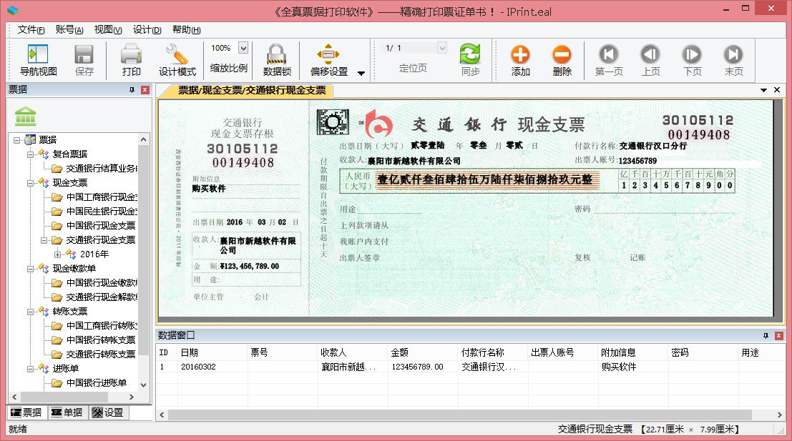

## 《全真打印软件》有哪些真功夫？

## 技术优势：
* 专业。支持云存储，数据无忧。（时光机）
* 安全。支持手机验证，数据恢复手机验证。
* 简单。无需复杂设置，每种票据仅需要打印一次取得偏移即可进行实际打印。
* 直观。《全真打印软件》所有操作均基于真实票据图象，软件中看到的，就是您的打印效果。
* 精准。《全真打印软件》的打印精度精确到一厘米的百分之一。
* 开放。《全真打印软件》中您可以轻松定制自己的专用票据、单据、合同、表格。
* 普适。《全真打印软件》支持针式、激光、喷墨、热敏等主流打印机。
* 智能。《全真打印软件》全面支持在线更新。
---

### 安全：

* 绿色无插件无广告。
* 数据均加密存储。

---

当然，以上这些还远远不够。

它还有一项巨大的优势：

### 价格：《全真打印软件》，免费的！

还等什么，还不下载使用？

        <a href="http://oss.myqzz.net/aime/全真打印软件安装.rar" alt="" title="立即下载《全真打印软件》" id="download">立即下载</a>

