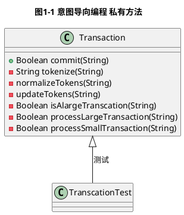
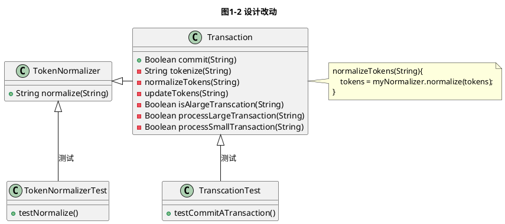
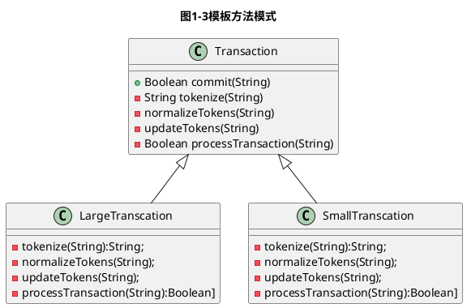
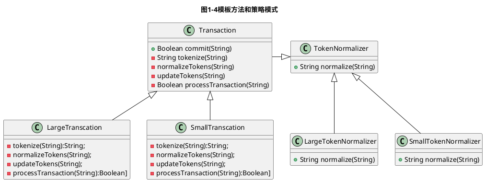

## 第一部分 最关键的小舵板

### 第一章 意图导向编程

#### 1.1 意图导向编程:一个实例

在这个实例中,需要写些代码。我们需要创建一个服务程序,它接受一个业务交易,然后提交。我们决定(不管是正确或错误)先简单创建一个对象,这个对象只包含一个公共方法来完成这件事。

具体需求如下:

* 1:交易信息开始于一串标准ASCII字符串。
* 2:这个信息字符申必须转换成一个字符串的数组,数组存放的值是此次交易用到的领域语言(domain language)中所包含的词汇元素(token)。
* 3:每一个词汇元素必须标准化(第一个字母大写,其余字母小写,空格和非字母数字的符号都要删掉)。
* 4:包含超过150个词汇元素的交易,应该采用不同于小型交易的方式(不同的算法)来提交,以提高效率。
* 5:如果提交成功,API方法应该返回"true";失败,则应该返回"false"。

这里并没有涉及某些细节(比如提交的算法具体是什么),这样就可以只关注我们感兴趣的实践。

有一点是应该充分利用的:在学习一种程序语言编码的时候,我们会把问题分解为一系到的功能性步骤,在这个过程中,我们的思维不断地得到锻炼。随着代码写得越来越多,我们解决这类问题的能力也变得越来越强。

继续考虑前面的那个问题,需求列出的每一点要求都代表一个功能性步骤。在写代码的过程中,我们会按照一定的顺序,有意识地去完成每一点要求。而意图导向编程是指,先假设当前这个对象中,已经有了一个理想方法,它可以准确无误地完成你想做的事情,而不是直接盯着每一点要求来编写代码。先问问自己:"假如这个理想的方法已经存在,它应该具有什么样的输入参数,返回什么值?还有,对我来说,什么样的名字最符合它的意义?"

现在,因为这个方法并没有实际存在,所以除了你自己的最终意图之外,没有任何其他东西的约束(因此,你是"意图在主导编程")。试试写出代码,像下面这样:

```java
//java code
public class Transaction {
    public Boolean commit (String command ) {
        Boolean result = true ;
        String[] tokens = tokenize ( command );
        normalizeTokens( tokens );
        if (isALargeTransaction(tokens)){
            result = processLargeTransaction (tokens);
        } else {
            result = processSmallTransaction (tokens);
        }
        return result ;
    }
}

```

书中此例所用的代码被包装到类Transcation中，我觉得对于当前的情况，不需要引入类来干扰问题的说明，只需要关注于实现的方法即可，同时，由于java语言的声明中就包含了返回值类型，所以，可以改进如下：
```java
//java code
Boolean commit(String command) {
    String[] tokens = tokenize (command);
    normalizeTokens(tokens);
    if (isALargeTransaction(tokens)){
        return processLargeTransaction(tokens);
    }
    return processSmallTransaction(tokens);
}


```
可以看到，
* 第2行：commit方法中的参数类型String，与我们需求1的要求交易信息开始于一串标准ASCII字符串相对应。
* 第3行：tokenize方法及其返回值类型。与我们需求2的要求这个信息字符申必须转换成一个字符串的数组,数组存放的值是此次交易用到的领域语言(domain language)中所包含的词汇元素(token)相对应。
* 第4行: normalizeTokens(tokens)方法，与我们需求3每一个词汇元素必须标准化相对应。
* 第5-8行： 则用:isALargeTransaction方法进行交易类型的判断。并分别用processLargeTransaction与processSmallTransaction两个处理函数来对不同交易类型进行处理。同时，返回值也满足需求5对返回值类型的要求。

同时，采用意图导向编程，对于不同的编程语言也是同构的，以下列出几种常用编程语言的实现。

```c++
//c++ code
bool commit(std::string command) {
    std::vector<std::string> tokens = tokenize(command);
    normalizeTokens(tokens);
    if (isALargeTransaction(tokens)){
        return processLargeTransaction(tokens);
    } 
    return processSmallTransaction(tokens);
}


```
对于python或javascript之类的语言，函数定义中有包含返回值类型的，则可以加入一个返回值变量以让代码意思更清晰易懂：

```python
#python code
def commit (command ):
	result = true
    tokens = tokenize(command)
    normalizeTokens(tokens)
    if isALargeTransaction(tokens):
        result = processLargeTransaction(tokens)
    else:
    	result = processSmallTransaction(tokens)
    
    return result

```

```javascript
//javascript code
commit(command){
	var result = true;
    tokens = tokenize(command);
    normalizeTokens(tokens);
    if (isALargeTransaction(tokens)){
        result = processLargeTransaction(tokens);
    }else{ 
    	result = processSmallTransaction(tokens);
	}

    return result;
}

```
commit()方法是我们为这个对象定义的应用程序接口(API)。当然,它是公共方法,这样才能交给客户端对象,为它们提供服务。所有其他方法(tokenize()、isALarge-Transaction()、processLargeTransaction()和processSma11Transaction())都不属于这个对象API的一部分,而仅仅是实现过程中的功能性步骤。因此,它们常常称为"辅助方法"(helper methods)。现在,我们先把它们当做私有方法(稍后我们会发现,这样做并不总是完全正确的)。重点是,它们是这个服务内部实现的一部分,而不是外界需要调用的接口。

并且,它们现在还没有真正存在。如果现在尝试编译一下代码,编译器肯定会报告它们并不存在(不过……我们将试这样能,让编译器帮助我们列出后续工作的待办事项清单。 为了代码编译通过,接下来我们必须要创建它们。

用这样的编码方式,我们可以把精力集中在如何分解最终目标,以及那些全局性的问题上。例如,我们必须考虑在实现语言中,用到的这个string数组是引用传递还是复制传递(很明显,我们猜想该语言是引用传递的；否则,我们就得把tokens作为nozmalizeTokens()函数的返回值保留下来)。至于其他单个步骤的实现细节,我们这里先不考虑。

这样做的意义是什么呢?我们很快会了解到,它有很多好处。但在此之前,让我们先确认一件很重要的事:这样做其实一点都不难。你的时间表里没有因此而增加更多的工作,与直接把所有代码写到一个很长的方法里(就像我们以前写程序一样,一大堆逻辑结构代码)的工作量是基本差不多的。仅有的少许不同,是我们思考的方式以及编码的顺序。 

这非常重要。理论上,好的实践应该是在任何时候都可以实行,并且能够推广到整个团队,成为那些可以一直贯彻执行的守则。事实上,只有当这些实践的执行成本很低(或者说,几乎零成本)的时候,才有可能做到这点。 

### 1.2优点

还是老问题,用这样的方式编程意义何在呢? 

有时候,这样一个小小的问题所引出的答案会令你惊叹不已。我们先把这些优点汇总罗列出来,再——进行分析。 

如果遵循意图导向编程的方式,那么代码将会: 

* 更加内聚(职责单一) 
* 更加可读和清晰。 
* 更易于调试。 
* 更易于重构和优化, 所以只做最少的设计,满足当前需要。
* 更易于单元翻试。

同时,从这些优点中还会延伸出其他优点:代码更易于修改和扩展。其他还有:
* 模式更容易应用到代码中。 
* 创建的方法可以容易地从一个类移动到另一个类。 
* 代码更易于维护。 

#### 1.2.1方法的内聚性 

代码的质量标准之一,就是内聚性。它促使代码更易于理解、更易于扩展和修改。通常 情况下,我们希望软件实体(software entity)具备单一的特性,换句话说,一个实体只为了 ——个目的或原因而存在。 

以类为例。一个类应该根据它的职责来定义,并且每个类通常应该只有一个职责。类的内部包含方法、状态以及与其他对象之间的关系,正是它们使得类的职责能够被正确地履行。在一个类的内部,如果各个方面都紧密相关,并且都在这个类的唯一职责范围之内,那么我们就说这个类的内聚性很强。 

你也许会对前面的例子提出异议,我们的代码中有些部分的职责实际上是不同的,它们应该放到不同的类中。或许,把它们完全梳理清楚是一件挺棘手的事情。但是,即使无法做到完美无缺,如果遵循意图导向编程的方式,在绝大多数情况下,仍然可以达到一定程度上的内聚性。

方法的内聚也是关于单一性的问题,不过关注点是在函数上。如果一个方法只实现整体职能中一个单独的功能点,我们就说这个方法的内聚性很强。人的思维方式是单线程的,当人们开始"多任务"的时候,他们实际上只是快速地在多个任务之间进行切换而已;我们仍旧习惯于一次只思考一件事情。意图导向编程正是利用这一事实,用我们思维链条单一性的特点去创建同样具备单一性的内聚方法。

意图导向编程能带来诸多好处的一个很重要的原因,正是方法的内聚性。 

#### 1.2.2 可读性和表达性

让我们再回过头来看看最初的代码示例,观察一下它的可读性怎样。

```java
//java code
public class Transaction {
    public Boolean commit (String command ) {
        Boolean result = true ;
        String[] tokens = tokenize ( command );
        normalizeTokens( tokens );
        if (isALargeTransaction(tokens)){
            result = processLargeTransaction (tokens);
        } else {
            result = processSmallTransaction (tokens);
        }
        return result ;

    }
}
```

代码基本上是这样"讲"的:"我们获得一个指令,准备提交。先对指令进行分词,把 词汇元素标准化,然后根据得到的词汇元素集合的大小,决定采用大型事务的机制还是小型事务的机制进行处理。最后,返回处理结果。" 

因为没有涉及每一步是"如何做",而仅仅是"做什么",所以只要快速地读一遍方法, 就可以很容易地了解到整体流程是如何工作的。有时候,我们需要的正是快速地了解事物在 如何运作。 

这种方式提供了很好的可读性,表达也很清晰。值得注意的一点是,我们并没有在代码 中包含任何注释,但读者很容易了解到其中的意义。这是因为我们想通过注释表达的东西, 都已包含在方法的名称中。 

当然,注释也是一种清晰的表达方法,但问题是,编译器看不到。同时,很多不相信注释准确性的程序员也会忽略它们。如果注释在代码中存在了很久,它就会变得不可靠,原因我们都很清楚:代码可能已经改变了,但注释或许并没有更新。如果过度相信注释,它可 能会误导我们,也没有其他简单的方法去验证是不是这样。我们只能被迫去调查代码,注释 的表达功能就这样蒸发掉了。因此,注释往往会被程序员忽略,失去它本来的作用。

回到我们讨论的主题,在意图导向编程中,组织一个方法的时候应该包括所有的流程步骤,但很少或者完全不用涉及实际的步骤实现。在某种意义上,这是另外一种形式的内聚: 把处理某件事的流程和具体做事的实现方式区分开。 

另一件促使代码更易读和清晰的事情是,当我们创建代码实体时,它们的名字应该能表达出创建的目的。如果方法是内聚的,用一两个词来完整描述它们是做什么的就变得很容易,而不用在名称中加入许多下划线、"and"和"or"。同时,在我们给方法命名的时候,它们还没有真正存在,这促使我们去选择能表达自己想法的名字。这种名字揭示了命名背后的意图,我们把它们叫做"表露意图的名称"(intention-revealing names)。有一些命名是我们应该尽量避免的,比如有些名字,当你明白功能是什么之后,它很容易理解;但在别人解释之前,又容易引起误解。

#### 注释会成为代码的一种"臭味"

虽然我们没有断言说,不应该写注释,但有些注释确实是代码的一种"臭味"。例如,假如我们写了这样的代码:
```java
public class Transaction (
	public Boolean commit ( String command ) (
		Boolean result = true :
		come hore
		bone coue liece
		Some more code here

		Even some more code here that sets tokens
		Some code here that normalizes Tokens
		Some more code here that normalizes
		some more coue use cnat normalizes ' rokens
		Even more code here that normalizes Tokens
		Code that determines if you have a large transaction
		Set 1t = true if you do
		
		if ( 1t ){
			Some code here to process large transactions
			More code here to process large transactions
		} else {
			Some code here to process small transactions
			有效期限
			More code here to process small transactions
		}
		return result ;
	}
}
```

当看到这段代码时,你可能会说:"天哪,我可不明白它在干什么;让我们加些注释吧。"然后在上面加了些东西:
```java
public class Transaction {
	public Boolean commit ( String command ) f
	Boolean result = true ;
	// tokenize the string
	Some code here
	Some more code here
	Even some more code here that sets tokens


	//normalise the tokens I am there that normalizes Tokens normalises Tokens 
	some cooe code here Some more c 
	The more code here that normalizes Tokens 
	see it you have a large transaction Code that determines 
	if you have a large transaction Cet Ite true if you do 
	if ( it ) {
		process large transaction It , 
		to process large transactions 公民身份号码 
		Some Here code here to process large transactions 
	) else ( 
		process small transaction time code here to process small transactions es , 
		code here to process small transactions 
		return result ; 
	}
}


```
注意到了吗?当写完代码之后,我们加入注释来描述做了什么。如果遵循意图导向编辑 的方式,这些注释就不再需要。前面提到的替代注释的方法其实更有用,因为编译的时候 它们(代码本身)一定是最新的。 

#### 1.2.3 调试 

在Net Objectives公司的培训课程中,我们往往会问学员一个问题,他们是否花费了大量 的时间来修改代码中的错误。除了那些已经上过我们课程的人外,大部分人的答案都是"是的"。这也是让软件开发变得棘手的一个主要原因。

我们向他们指出,在调试过程中,寻找系统中的错误所在才是最花时间的部分。一旦错误装定位,修复工作反而不是什么太大的问题。几乎所有的学员听到这点,都会立刻点点头。由此可见,在创建需要调试的代码时,真正的技巧是用一切手段让代码中的错误容易再现。当然,我们应该尽量小心,在开始写代码的时候就别犯错。但是,哪怕你做到了尽善尽美,往往还有别人要来改动这段代码。

当遵循意图导向编程的时候,我们更容易做到让一个方法只做一件事。这时候,如果系统中有些部分不能正常工作了,试试下面的方法:

* (1)通读一遍整个方法,看看所有事情是怎么运作的。 
* (2)对无法正常工作的部分,检查一下辅助方法的细节有什么问题。 

相对于费力地查阅一大段复杂的代码,尤其是有些代码还可能涉及许多不相关的系统的方方面面,这种调试方法发现代码借误的速度要快得多。 

例如,调试遗留系统是个苦差事,因为问题往往是多种原因共同引起的。其中一个很大的因素是它的代码常常是一大段一大段写出来的。因此,你最后不得不把代码打印出来,准备好各种彩色荧光笔,根据代码是做什么的来进行逻辑分块。"我会把数据库部分标为黄色, 业务逻辑标为蓝色......",这样做既艰苦又容易出错,还很枯燥,对程序员来说,这可不是打发时间的好方式。还是让计算机来完成这些让人厌烦的工作吧。 

#### 1.2.4 重构和增强

在创建系统的最初阶段,我们很难准确地知道设计应该做到什么程度,复杂度又是多少。由于复杂度是引起系统难以修改的原因之一,所以,如果可以的话,我们希望做最少的设计,仅仅增加那些真正需要的东西,让系统正常运行。 

尽管如此,当我们实际做的时候往往会犯下很多错误,真正需要的功能并没有正确运行。或者即使我们的系统终于正常工作了,来自客户、利益相关人员或者市场的需求又更改了规则。 基于这点,我们常常需要这样做: ·重构系统(保持系统行为不变的情况下,更改它的结构)。 

增强系统(增加或修改系统的行为以符合新的需求)。

重构通常认为是"清理"刚开始时写得糟糕的代码。有时候项目十万火急,我们没有认真顾及代码质量,草草维护和修改,代码就在这个过程中变得腐朽不堪。或者,当我们对整个程序有了更深的了解,清楚地知道代码需要重新设计时,也可以用到重构。 

1999年,Martin Fowler写了一本经典的书籍《Refactoring》9,这本书记载了各种不同 的、在保持系统行为不变的情况下,如何修改代码的方法,并给每种方法命了名(通常叫做一次"迁移")。 

在学习重构原则的时候,大多数人首先学到的一个迁移方法叫做提炼函数(Extract Method);把一部分代码从一个巨大的方法中抽取出来,放到一个属于它自己的新方法中。而在原来代码中的那个位置直接调用这个新方法。由于原来方法的一部分临时变量也需要迁称到新方法中,所以需要多个步骤才能完成一个函数的提炼。

该书在讲述许多其他的重构迁移方法时,开始都有一句基本说明"在开始这个方法之前,你需要不断地采用'提炼函数'方法,直到所有的方法都是内聚的。"如果你遵循意图导向编程,你会发现你已经做到了这点。Ken Pugh在《Prefactoring)一书中也广泛地研究了像意图导向编程这样简单而有效的方式是如何更好地帮助我们编写程序的。

如果你已经做到了书中所写的那样,在写代码时习惯性地先"预构"(prefactored),则进行代码重构的时候,困难就要少很多。代码的方法内聚性越强,重构就越容易。

同样,意图导向编程能够让系统在以后增强时变得更加容易。让我们回到前面交易处理程序的例子。

设想一下6个月后,这些代码已经成为产品,一个新的需求加入进来:由于与这个业务交易系统有交互的某些第三方程序的原因,我们必须对某些旧版本的词汇元素进行转换(需要转换的词汇元素可能有很多)以支持整个系统的运行。现在,命令字符串中可能包含领域语言不再兼容的词汇元素,为了处理这种情况,我们必须再"更新"一下所有词汇元素。

在这种情况下,我们只需做出一个小小的修改。你大可拍着胸脯说:"没问题。"

```java
//java code
public class Transaction {
    public Boolean commit (String command ) {
        Boolean result = true ;
        String[] tokens = tokenize ( command );
        normalizeTokens( tokens );
        updateTokens(tokens)
        if (isALargeTransaction(tokens)){
            result = processLargeTransaction (tokens);
        } else {
            result = processSmallTransaction (tokens);
        }
        return result ;

    }
}
```
接下来,就是写出updateTokens()方法,在这个过程中我们会发现,新代码对原新的其他部分造成破坏的可能性是非常小的。事实上,修改这段代码里的任何辅助方法,我们都可以信心十足地认为,我们仅仅改动了想要改变的部分。就像上面这样,内聚性让我们更容易进行封装。

#### 1.2.5 单元测试 

在意图导向编程中,如果一个对象尚未完成,我们不会去扩充它的外部接口;相反,要确保在代码实现之前就把接口定义清楚。事实上,我们希望遵照模式所推荐的关于设计的基本建议:使用服务的客户端,在设计时应当遵照的是它的接口定义,而不是服务中的具体实现。 

所以,至少在刚开始的时候,最好能把这些"辅助方法"都隐藏起来,因为它们都不是服务对外提供的API。我们不希望将来某一天,外部其他对象与这些方法发生什么关联(无 论是运作流程上的关联,还是直接存在引用关系)。这样可以让我们做到,在问题的方案细节发生变化的时候,无须修改系统中其他用到该对象的地方。

尽管如此,如果我们把所有的辅助方法都变成私有方法,又似乎不利于对象测试(参见 图1-1)。




私有方法无法被单元测试调用,因此我们只能针对commit()方法来写测试,这意味着必须在一个单独的测试用例中测试对象的整体行为。这样的测试可能比你想象的要复杂得多,同时,在编写测试的过程中,有多种因素都有可能导致测试失败。我们可不想发生这些的情况。

也许我们可以解决这个难题。但不管怎样,把系统整体行为的各个不同方面区分开来。放到独立的方法中,至少在理论上让每个方法具备了可测试性,因为它们彼此之间不再耦合。就像使用这个类的客户端只与这个类的接口发生关联一样,在类的内部,AP1方法的实现只与辅助方法的接口发生关联。 

那么,我们怎样来处理私有方法不能测试的问题呢?一般来说,有三个可行的方法:

* 不用一个个地单独测试它们,只通过commit()方法来测试。在单元测试中,被测试的是行为而不是实现,所以如果这些辅助方法只是单个行为实现步骤的一部分,就没必要测试它们。我们希望在重构这些方法(甚至删除它们)之后,原来的测试仍! 旧能正确通过。

* 在通常情况下,我们还是需要对它们进行单独的测试。尽管它们只是"单个的步骤",但我们知道它们会有弱点,在某些状况下可能会出错。从效率和安全性上考虑,应当把它们从整体流程中区分开来,进行单独测试。这种情况下,我们需要用些小聪明,加上一点儿测试技巧。这些技巧取决于开发语言本身,比如:把测试用例标注为被测试类的"friend"(在C++中),然后把私有方法包装进一个委托(delegate) 方法中,再测试这个委托方法。有时这也称为"测试代理"(testing proxy)(在.Net中),把方法变为"protected",在类的内部发起测试等。但要当心这些技巧过度使用;其他程序员可能无法理解你在做什么,尤其是当他们刚从一种语言平台转向另一种的时候,常常会晕头转向。同时,我们也不希望把测试与具体实现关联得大紧, 除非这么做是必要的。 

* 事实上,有时候这些辅助方法理所应当单独测试,因为它们不仅仅是"流程的单个 步骤",而是完全不同的行为。或许它们在这个类中只是被用到,但在实现上讲,承 担完全独立的职责。测试这个类的同时也促使我们思考:"它们真的只是一个步骤 吗?"这也是设计时非常重要的一个方面。如果是这种情况,那么我们需要重新思考 当前的设计。例如,仔细想想,词汇元素标准化这一步就满足这种情况,应该单独测 试。这需要我们简单修改一下设计(参见图1-2)。




你或许注意到了,对TokenNormalizer的使用也是私有的。除了Transaction外,没其他地方用到TokenNormalizere,尽管如此,对TokenNormalizer的实现仍然是通过它自己定义的API,因此进行单独测试也变得可行了。 

同时,你也会发现,由于一开始我们已经把词汇元素标准化这部分代码放在了独立的方法中,所以把它们抽取出来放到一个单独的类里就变得非常简单。如果方法一开始就是内聚 的,抽取一个新的类就变成一件轻而易举的事。因此,当我们需要时,就可以很快做出决 定,而不用考虑太多限制。 

这样做的另一个原因是,系统中可能有其他实体也需要进行词汇元素标准化。如果这个 标准化的算法绑定在Transaction类的私有方法中,那么在类之外的其他环境里是无法使 用的。但如果它放在一个单独的类里,那么就可以调用它。因此,期望避免代码重复也会 促使我们做出同样的决定。 

#### 1.2.6更易修改和扩展 

就像前面看到的那样,意图导向编程使得代码质量得到提升,代码的修改和扩展也随之变得更加容易。经验告诉我们代码总会变化,只是我们现在并不清楚要修改什么地方,改成什么样子。意图导向编程帮助我们在几乎不花成本的情况下,创建更适合改动的代码。 

#### 1.2.7在代码中发现模式

在Net Objectives公司,我们提供了很多设计模式的相关培训;在各种学术会议中,模式地格是被反反复复地提到。当我们即将变成·模式先生"的时候,总会有个家伙站出来说:"模式是很酷,但我怎么知道在特定环境下到底该使用哪个好呢?" 

这个问题的答案会引起一段很长却有趣(至少我们这么想)的对话,不过,如果遵循意 图导向编程,你就会发现模式有时就在你的代码实现当中。 

让我们稍微改动一下前面的例子。 

假如有两个完全不同的交易类型,它们的流程步骤一样(分词、标准化、更新、处理), 但每一步的实现方式不同。如果使用意图导向编程的方法来编码,尽管它们实现的"辅助" 方法不同,但是commit()方法看起来都差不多。这时候,你会发现模板方法模式(Template Method Pattern) O基本上已经站起来在向你挥手了(参见图1-3)。 




更进一步,回到可测试性的问题。我们应该开始把这些行为抽取出来,让它们可以测试。在这个过程中,我们会发现这是使用策略模式的好机会。像上次一样,我们把词汇元素标准化这部分代码抽取出来(参见图1-4)。





图1-4模板方法和策略模式

#### 1.2.8 可迁移的方法

前面我们提到,类的内聚性是这样一个概念,一个类在理想情况下,应该只有一个职责。它可以包含许多方法、成员变量以及与其他对象的关联关系来实现这一职责,但应当只有一个存在或需要修改的理由。

意图导向编程通过一个简单的途径帮助我们创建内聚的方法:用自己的经验把功能进行分解。但是,这样做不会直接增强类的内聚性。实际上,很容易发现,在我们最开始编写Transaction类的代码的时候,它的内聚性并不强。

要提高类的内聚性,一个办法是把这个类不应该有的方法全都迁移到其他类,或者新的类中,这样可以让这个类所关注的东西减少。因此,虽然意图导向编程没有直接实现类的内聚,但它让开发人员以后做起来更容易:内聚性问题出现的时候,就重构。

为什么更容易?

前面我们已经看到了其中一个原因。意图导向编程创建的方法只完成一个功能,这样避免了迁移方法时经常遇到的一个问题:方法中包含不能移走的部分。当一个方法只做一件事情的时候,如果它的一部分需要迁移,那么整个部分都应该移走。

此外,还有另外一个原因。有时候,一个方法很难迁移,是由于它直接关联到了类中的状态变量(state member)。在迁移方法的过程中,我们也必须移动这些状态,或者找个办法让这些状态在方法迁移之后也能用得到。

我们发现,当采用意图导向编程的方式编写代码的时候,我们更习惯于把需要用到的各种参数传递到方法中,再获取一个返回结果,而不是直接让方法使用对象的状态。如果没有与所在对象的内部状态发生关联,那么这些方法迁移起来就会更容易。 
回到前面的例子,我们也许会这样做: 

```java

public class Transaction{private String[] tokens; 
	public Boolean commit(string command){
		Boolean result = true；
		tokenizen();
		normalizeTokens）
		if (isALargerransaction()){
			result = processlargeTransaction(); 
		} else{
			result = processsmallTransaction();
		}
		return result;
	}
} 

```

把tokens数组作为类的一个成员变量,原来把它用做参数的所有方法现在都可以简单 地直接引用它。意图导向编程无法强制你不这么干(它仅仅能够帮助我们避免把方法命名为ml()或go()之类),但它会让你的思路更自然地想到传递参数然后返回结果。根据我们了解到的情况,在使用意图导向编程的开发人员中,这样思考的人占绝大多数。 

### 1.3小结 

要让复杂的人类活动变得成熟和完善,一个至关重要的方面是发掘出那些有助于行动成 功的重要实践。在理想情况下,这些实践应该满足:

* 带来很大价值。 
* 做起来相对简单。 
* 推广以及指导工作比较容易。 
* 风险低。 
* 通用(即使在不同的环境下,也不用犹豫是否要做)。 

意图导向编程正是这样的一种实践。试试它吧!对绝大多数人而言,仅仅需要几个小时,就可以发现它简单、有趣,不用花费额外的精力就能写出更好的代码。


